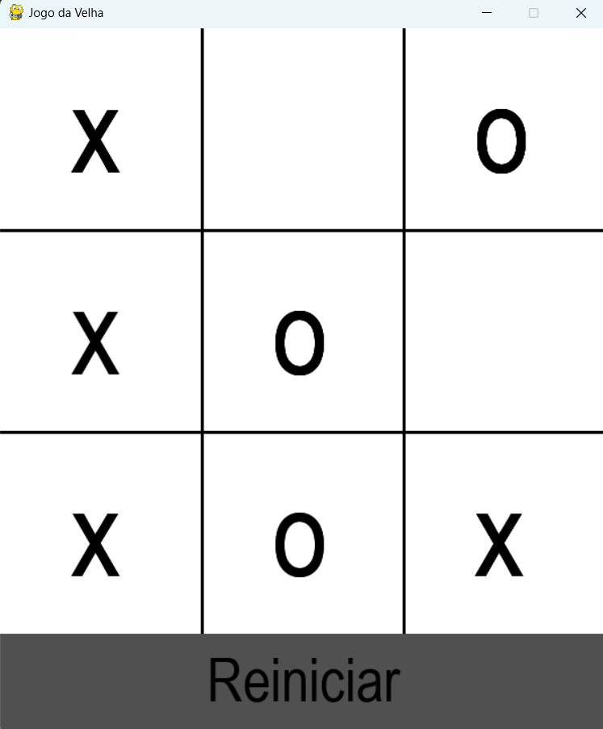

# Jogo da Velha

Sejam bem Vindos!!!

## Como funciona o Jogo

As regras são as mesmas do tradicional jogo da velha. O game tem algumas peculiaridades, o jogo não pode ser
reiniciado enquanto não houver um vencedor, quando um jogador vence a partida, não é possível continuar marcando
no tabuleiro.

O jogo espera que seja jogado por duas pessoa usando a mesma máquina.

Divirta-se!!!

## Prints do Game desenvolvido

## Sobre o que aprendi desenvolvendo esse projeto

Este é o meu primeiro projeto realizado após concluir os cursos de python da Alura.
Esse projeto foi inicialmente pensado para ser construido com orientação à objetos e TDD,
porém durante o desenvolvimento notei que estava adicionando camadas de complexidades desnecessárias.

### Portanto as habilidades que desenvolvi
* Entender melhor a lógica de desenvolvimento de games
* Criar uma interface gráfica e explorar as documentações e conteúdos com o pygame
* Programar é refazer o código quantas vezes forem nescessárias 

Ainda tenho muito o que melhorar : )
Obg!
